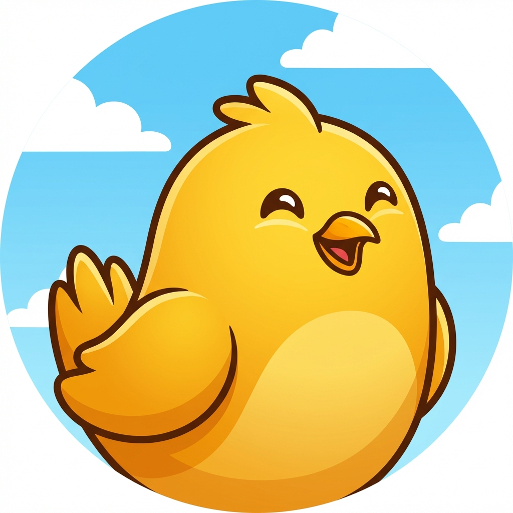

# 🐦 Flappy Bird - Mobile Edition



A fully-featured **Flappy Bird game** built with Python Kivy, ready to be converted to an **Android APK**!

## ✨ Features

- 🎮 **Smooth Gameplay** - 60 FPS with optimized physics
- 📱 **Mobile-Ready** - Touch controls and APK export
- 🏆 **Medal System** - Gold, Silver, Bronze achievements
- 📊 **High Score Tracking** - Persistent best score
- 🎨 **Beautiful Graphics** - Modern UI with 3D effects
- 🔊 **Background Music** - Optional audio support
- ⚡ **Cross-Platform** - Windows, Linux, macOS, Android, iOS

## 🚀 Quick Start

### Test on Windows (2 minutes)

```powershell
.\setup.ps1
```

### Build APK for Android (Linux/WSL)

```bash
chmod +x setup_linux.sh
./setup_linux.sh
./build_apk.sh
```

## 📚 Documentation

- 📖 **[QUICKSTART.md](QUICKSTART.md)** - Start here! Quick setup guide
- 📱 **[README_APK.md](README_APK.md)** - Detailed APK building instructions
- ✨ **[IMPROVEMENTS.md](IMPROVEMENTS.md)** - Feature comparison & improvements

## 🎮 How to Play

**Controls:**
- 🖱️ **Click** or **Tap** screen to jump
- 🎯 Avoid the green pipes
- 📈 Score points by passing pipes
- 🏆 Earn medals based on your score

**Scoring:**
- 🏆 **Gold Medal** - 20+ points
- 🥈 **Silver Medal** - 10+ points
- 🥉 **Bronze Medal** - 5+ points

## 📂 Project Structure

```
flappy_bird_game/
├── main.py                 # Main game file (Kivy version) ⭐
├── flappy_bird_kivy.py     # Same as main.py (backup)
├── flappy_bird.py          # Original tkinter version
├── buildozer.spec          # APK build configuration
├── icon.png                # App icon
├── setup.ps1               # Windows setup script
├── setup_linux.sh          # Linux/WSL setup script
├── QUICKSTART.md           # Quick start guide
├── README_APK.md           # APK building guide
└── IMPROVEMENTS.md         # Feature comparison
```

## 🛠️ Requirements

### For Testing on PC:
- Python 3.8+
- Kivy (`pip install kivy`)

### For Building APK:
- Linux or WSL2 (Windows Subsystem for Linux)
- All dependencies (auto-installed by `setup_linux.sh`)

## ⚡ Quick Commands

| Action | Command |
|--------|---------|
| **Test on Windows** | `python main.py` |
| **Setup Windows** | `.\setup.ps1` |
| **Setup Linux/WSL** | `./setup_linux.sh` |
| **Build APK** | `./build_apk.sh` |
| **Install APK** | `buildozer android deploy run` |

## 📱 APK Build Time

- ⏱️ **First build:** 30-60 minutes (downloads Android SDK/NDK)
- ⚡ **Rebuilds:** 2-5 minutes

## 🎨 Customization

Edit `main.py` to customize:

```python
# Game difficulty
self.pipe_speed = 3         # Increase for harder
self.pipe_gap = 200         # Decrease for harder
self.gravity = 0.5          # Increase for more challenge

# Colors (in RGB format)
Color(0.53, 0.81, 0.92, 1)  # Sky blue background
Color(1, 0.84, 0, 1)        # Gold bird
Color(0.18, 0.55, 0.34, 1)  # Green pipes
```

## 🌟 Improvements Over Original

✅ Mobile support (Android/iOS)
✅ Touch controls
✅ APK export capability
✅ Better physics and gameplay
✅ Enhanced graphics with 3D effects
✅ Medal achievement system
✅ Professional restart button
✅ Adaptive screen sizing
✅ Cross-platform support

See [IMPROVEMENTS.md](IMPROVEMENTS.md) for detailed comparison.

## 🐛 Troubleshooting

### Game won't start
```bash
pip install kivy
python main.py
```

### APK build fails
```bash
# Clean and retry
buildozer android clean
rm -rf .buildozer
./build_apk.sh
```

### WSL2 not working
```powershell
# Run as Administrator
wsl --install
wsl --update
```

See [README_APK.md](README_APK.md) for more troubleshooting.

## 📄 License

Free to use and modify for educational purposes.

## 🤝 Contributing

Feel free to fork, improve, and share!

## 📞 Support

1. Check [QUICKSTART.md](QUICKSTART.md) for quick setup
2. Review [README_APK.md](README_APK.md) for detailed APK building
3. See [IMPROVEMENTS.md](IMPROVEMENTS.md) for feature details

---

## 🎯 What's Next?

1. ✅ **Test the game** - Run `python main.py`
2. ✅ **Customize it** - Change colors, difficulty, etc.
3. ✅ **Build APK** - Follow instructions in README_APK.md
4. ✅ **Share with friends** - Install on Android devices!

---

**Made with ❤️ using Python and Kivy**

**Happy Gaming! 🎮🐦**
